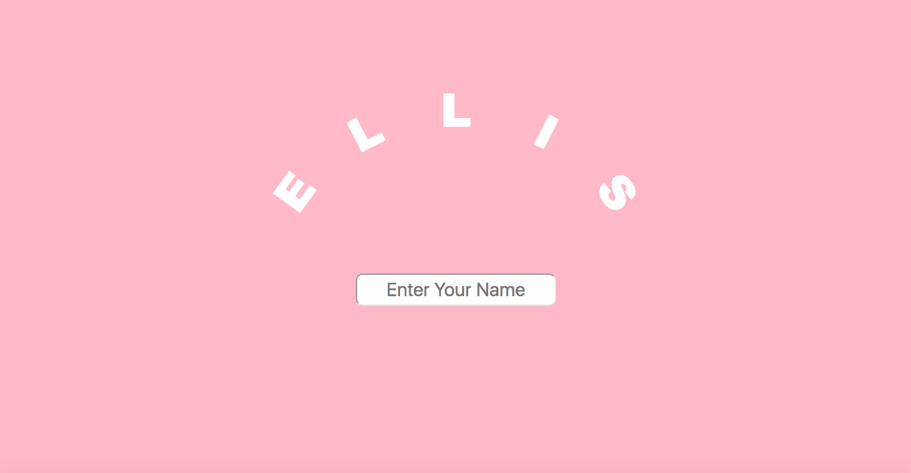
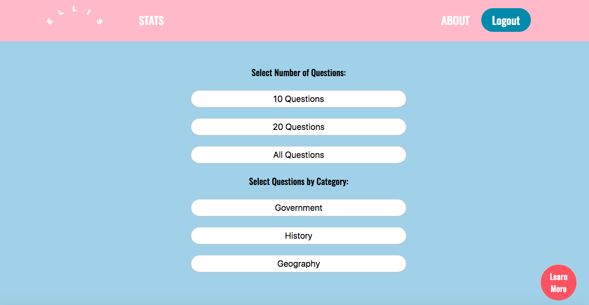
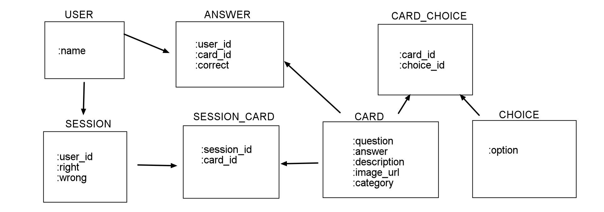

# Ellis App

**Final Project for [Flatiron School](https://flatironschool.com/) Module 3 (Vanilla JavaScript & Ruby on Rails)**

## PROJECT DESCRIPTION

### Goal
A web application to study for the U.S. citizenship test, using an interactive flashcards. Using ActiveRecord associations and SQLite, the application stores data on each individual user's past scores and visualizes the analysis using Chart.js. 

### Functions 
Ellis is a Vanilla JS application using Ruby on Rails API as the backend. Upon login, user is prompted to the home page where they can see past score stats, choose from different number of questions or different categories of questions. The questions are randomized for each session. Learn More button leads to detailed information of the citizenship test process, available in English, Spanish & Chinese. 

## PROJECT REQUIREMENTS

1. Must be a HTML/CSS/JS frontend with a Rails API backend. All interactions between the client and the server should be handled asynchronously (AJAX) and use JSON as the communication format. 
2. Backend must render a resource with at least one has-many relationship. For example, if we were building Instagram, we might display a list of photos with associated comments.
3. The backend and frontend must collaborate to demonstrate Read, Create, and either Update or Delete for at least two of your models. The results of each action should be diplayed to the user without a page refresh.  

**Time allocated: 5 days**

## MODEL FLOW CHART

### Collaborator:
[@ekatsuta](https://github.com/ekatsuta)
